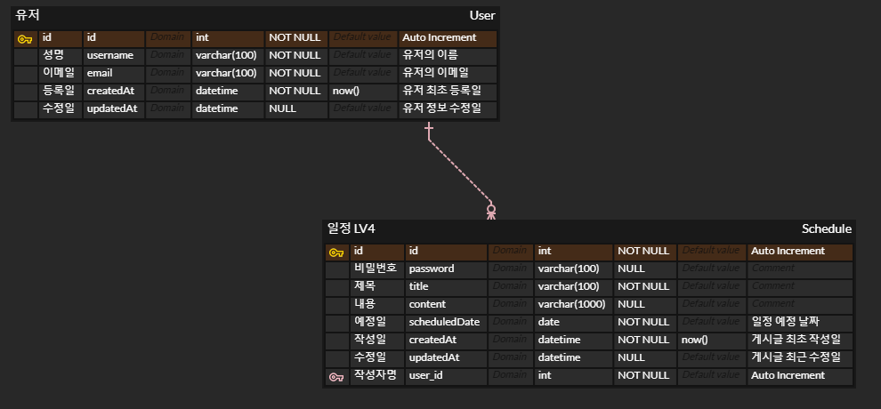

# Spring 을 이용한 일정 관리 앱

* 목표 : Spring 에서의 CRUD 기능을 이해하고 구현할 수 있으며 데이터베이스와
연결하여 이를 확장 시켜보자

## 📄 목차
1) API 명세서
2) ERD 소개 및 설명 (Lv1 ~ Lv3, Lv4 ~)
3) 기능 소개
4) 사용 방법
5) 사용 기술
6) 소감

---

### 1️⃣ API 명세서

참고 사이트 : https://documenter.getpostman.com/view/29058403/2sAXqzVcwU

> PostMan 에서 제공하는 API Document 작성 툴을 이용하여 위 사이트에 게시하였습니다.

---

### 2️⃣ ERD 소개 및 설명

#### LV1. ~ LV3 의 ERD
!
> LV1 ~ LV3 에서의 테이블은 `일정` 테이블 단 한개로서 해당 테이블을 
통해 유저가 입력한 유저의 정보와 일정 정보를 통합해서 관리하는 테이블 
입니다.

> LV4 ~ LV5 에서 사용되는 테이블의 구조입니다. `일정` 과 `유저`를
각각 나타내는 테이블인 `Schedule` 과 `User` 테이블의 관계입니다
`유저` 테이블에 id 값을 통해 유저들을 구별 할 수 있도록 하였습니다.

---

### 3️⃣ 기능 소개

(1) : Controller 레이어
> 클라이언트의 요청을 처음으로 받는 레이어 입니다.  
여러가지 종류의 요청을 각자 맞는 컨트롤러로 DispatcherServlet 이 매핑하며 
>내부에서 각자 수행할 조건에 맞는 서비스를 호출하여 실행 후 응답이 필요하면 응답을 해줍니다.
>   또한 `view` 응답이 필요한 경우 `@RestController` 대신 `@Controller` 를 이용하여
> 페이지를 응답했습니다.

(2) : Service 레이어
> Controller 레이어와 Repository 레이어의 중간에서 필요한 로직을 수행합니다.  
> Repository 를 통해 받아온 데이터를 비즈니스 로직에 맞는 작업을 수행하고 적절한 응답을 컨트롤러로 제공합니다.

(3) : Repository 레이어
> 직접적으로 db와 작업을 수행하는 레이어로서 jdbcTemplate 을 이용한 sql 문을 이용하여 db의 데이터를 
> 생성, 읽기, 수정, 삭제를 진행 합니다. 
> 이후 적절한 응답을 서비스로 반환합니다.
>
(4) : entity
> 실질적으로 db에 저장될 데이터의 형태를 나타냅니다. 하나의 `필드`가 db 에서 하나의 `column`이 됩니다.
>   또한 관계가 필요한 `도전 구현` 의 경우는 관계 설정에 필요한 메서드 또한 구현되었습니다.

(5) : dto
> 클라이언트가 요청시 들어오는 데이터의 형태를 나타냅니다. 해당 `요청 객체`를 서버가 받아서 해당 
> 객체를 기반으로 데이터를 이용합니다. 또한 `응답 객체`를 통해 사용자가 필요한 정보만 응답 받을 수 있도록 설계하였습니다. 
> 이외에더 `페이지네이션` 을 하기위한 `Paging` 클래스도 존재합니다.

(6) : GlobalExceptionHandler
> `id` 값을 통해서 일정 row 에 접근하는데 만약 해당값이 존재하지 않는 경우 예외를 처리할 클래스 입니다.

(7) : resources 디렉토리
> 프런트 엔드의 뷰를 구현한 코드들 입니다. html, css 를 통해 페이지의 구조와 디자인을 구현하였습니다.
>   그리고 js 코드를 이용하여 모달, 서버로의 요청을 구현하였습니다.

---

### 4️⃣ 사용 방법
1. 해당 파일을 클론 또는 zip 파일로 다운로드 합니다.
2. 의존성 설치 및 빌드 작업을 수행합니다.
3. 사용자의 환경에 맞는 db 설정을 application.properties 에 작성합니다.
4. 파일에 있는 `scehdule.sql` 을 실행하여 테이블을 생성합니다.
5. 이후 어플리케이션을 실행하고 localhost:8080 에 접속합니다.
6. 접속 후 달력의 날짜를 클릭하여 일정을 작성할 수 있습니다.
7. 상단의 "일정 보기" 버튼을 누르면 자신이 작성한 일정을 최신 수정 순으로 볼 수 있습니다.
8. 이후 작성자, 제목, 내용, 일정 진행 예정 날짜를 수정 할 수 있으며 이전에 일정 작성 시 기입한 비밀번호를 통해 수정이 가능합니다. 
9. 마찬가지로 삭제 또한 해당 비밀번호를 이용하여 삭제 할 수 있습니다.
10. 작성자 명, 수정 날짜를 필터링 하여 조회 할 수 있습니다.
11. 일정 보기 페이지 아래부분을 통해 페이지를 이동 할 수 있으며 한 페이지에 표시할
일정의 개수를 지정 할 수 있습니다.

---

### 5️⃣ 사용 기술

1) jdbcTemplate 을 사용하여 직접적으로 sql을 작성해서 원하는 방식으로 데이터를 CRUD 하였습니다.
2) 프런트엔드의 javascript 코드에서는 `fetch` 를 이용하여 서버에 적절한 요청을 보냈습니다.
3) Spring 의 MVC 패턴을 구현하여 3 Layer 아키텍처를 구현하였으며 각각의 역할 분리를 통해 이상적인 코드를 작성하였습니다.

---

### 6️⃣ 소감
Spring 의 MVC 패턴 그리고 jdbc 와 sql, 그리고 fetch 와 페이지네이션을 구현하였습니다.
생각보다 쉽지는 않은 과정이었던것 같습니다. 특히 jdbc 의 코드는 이해하거나 구현하기 어려웠던 것 같습니다.
`JPA` 에 대한 지식이 어느정도 있는 저로써는 구지 왜 `jdbc` 를 사용하는지 의문이 들었습니다.
하지만 직접 코드로 구현해보고 공부해보니 `sql` 에 대한 공부가 되었고 실제로 `repository`의 동작 방식에 
대해서 많이 생각해 보게 되어서 좋은 경험이었던 것 같습니다.