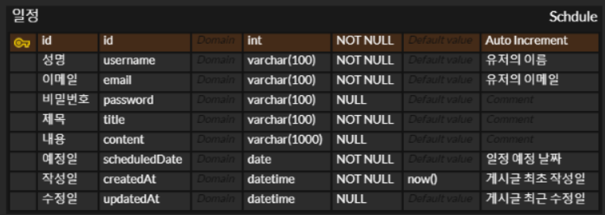

# Spring 을 이용한 일정 관리 앱

* 목표 : Spring 에서의 CRUD 기능을 이해하고 구현할 수 있으며 데이터베이스와
연결하여 이를 확장 시켜보자

## 📄 목차
1) API 명세서
2) ERD 소개 및 설명 (Lv1 ~ Lv3, Lv4 ~)
3) 

---

### 1. API 명세서

참고 사이트 : https://documenter.getpostman.com/view/29058403/2sAXqzVcwU

> PostMan 에서 제공하는 API Document 작성 툴을 이용하여 위 사이트에 게시하였습니다.

---

### 2. ERD 소개 및 설명

#### LV1. ~ LV3 의 ERD

> LV1 ~ LV3 에서의 테이블은 `일정` 테이블 단 한개로서 해당 테이블을 
통해 유저가 입력한 유저의 정보와 일정 정보를 통합해서 관리하는 테이블 
입니다.

... 추후 추가 예정입니다.